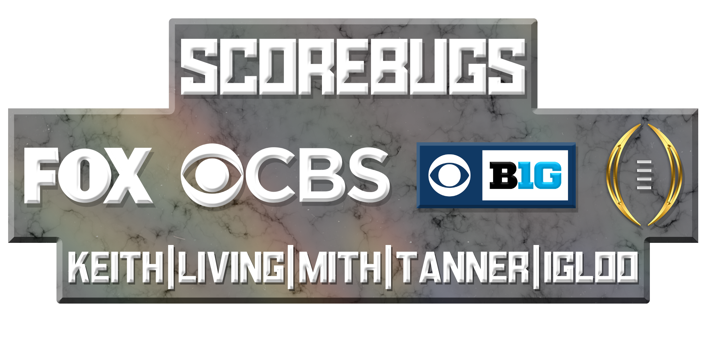

# CFBR Scorebug Mods

  

---------

## Released Scorebugs:
| **Scorebug** | **Network** | **Release** | **Version** | **Link** | **Credits** |
|:--|:--|:----|:---|:----|:--|
|  | FOX 2020-22 | 6/2/24 | 1.0 |[Download](https://github.com/dylanhale/ScorebugMods/blob/main/Scorebugs/FOX/index.md) | TheKeith (APT Edits and Textures) Tanner Watkins (Textures), LivingHuman (Textures)
|  | CFP 2020-22 | 9/10/23 | 1.6 | [Download](https://github.com/dylanhale/ScorebugMods/blob/main/Scorebugs/CFP%202022/index.md) | Mith(textures), TheKeith, Igloo, LivingHuman(textures)
|  | FOX 2017-19 | 9/10/23 | 1.0 | [Download](https://github.com/dylanhale/ScorebugMods/blob/main/Scorebugs/FOX%2017-19/index.md) | TheKeith
|  | CFP 2015-17 | 9/15/23 | 1.0 | [Download](https://github.com/dylanhale/ScorebugMods/blob/main/Scorebugs/CFP%2015-17/index.md) | TheKeith
|  | ESPN 2015-17 | 9/15/23 | 1.0 | [Download](https://github.com/dylanhale/ScorebugMods/blob/main/Scorebugs/ESPN%2015-17/index.md) | TheKeith
|  | CBS | 2/20/24 | 1.2 | [Download](https://github.com/dylanhale/ScorebugMods/blob/main/Scorebugs/CBS/index.md) | TheKeith, Mith (Textures), Tanner Watkins (Textures), LivingHuman (Textures)
|  | CBS B1G | 2/20/24 | 1.0 | [Download](https://github.com/dylanhale/ScorebugMods/blob/main/Scorebugs/CBS%20B1G/index.md) | TheKeith, Mith (Textures), Tanner Watkins (Textures), LivingHuman (Textures)

---------

## Install Instructions:
| **Platform** | **Instructions Link**|
|:--------|:-----|
|  | Coming Soon
|  | [Instructions](https://github.com/dylanhale/ScorebugMods/blob/69ea0a923134e8f810f1c6f576b20ab6aabd85d5/assets/Install%20Instructions/PS3%20Install%20Instructions/Easy%20Install/index.md)
|  | [Instructions](https://www.youtube.com/watch?v=JRn3-AW1ub0)

---------

## V21 Future Scorebug Releases/Updates:
| **Scorebug** | **Scorebug Name** | **Credits** |
|:--------|:-----|:----|
|  | CBS B1G | TheKeith, Mith (Textures), Tanner Watkins (Textures), LivingHuman (Textures) 
|  | CFP 2018-19 | 
|  | ESPN 2018-19 | 
|  | ESPN 2020-22 | TheKeith, Igloo

---------
