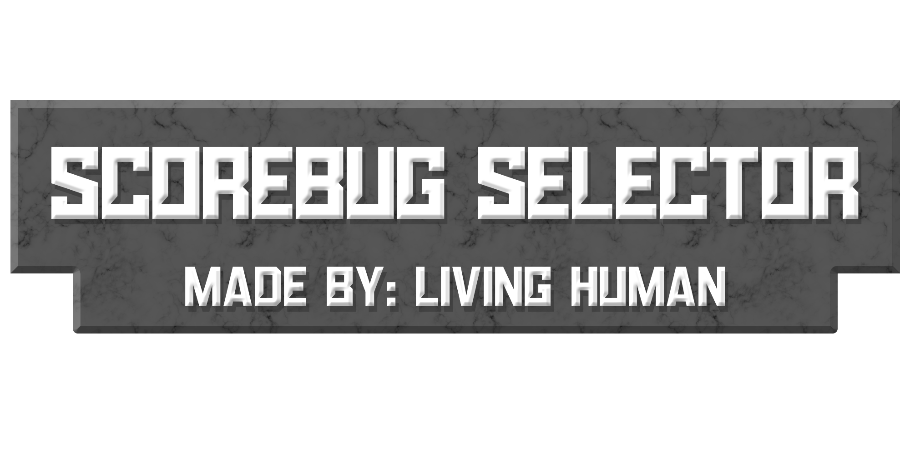

# Scorebug Selector by LivingHuman Download

  

### Scorebug Selector RPCS3 Install Instructions
1) Download the Scorebug Selector from [Here](https://www.mediafire.com/file/0kpep3tm7lq0jki/Scorebug_Selector_v1.6.rar/file)

1) Extract the Scorebug Selector.bat and Scorebugs folder to the root directory of CFBR. Located at - (RPCS3\dev_hdd0\disc\BLUS31159-[NCAA Football 14]\PS3_GAME\USRDIR)

2) Go to https://github.com/dylanhale/ScorebugMods and download the scorebugs you want from there. These are pre-packaged AST files which just need to be renamed and placed into the Scorebugs folder.

3) Your current qkl_interface, boot, fe2ig, and patch files which are whatever scorebug you are currently using should be renamed in accordance with the file names section which can be found in the README.txt and placed into the scorebugs folder. This makes it so that you do not accidently lose any game files. This means that if you are currently using the CBS Scorebug, you'd rename qkl_interface.ast to CBSInterface.ast, qkl_boot.ast to CBSBoot.ast, qkl_fe2ig.ast to CBSFE2IG.ast, and qkl_patch.ast to CBSPatch.ast and then move those files into the Scorebugs folder overwriting the exisitng blank placeholder files.

4) Note that the Scorebugs folder contains empty placeholder files, when you place a file in that folder just overwrite what is in there. The empty files are there as a guidance for naming and are also needed for the Selector to work properly and to not list every non installed scorebug as "active".

5) Ensure they are named in accordance with the File Names Section found in the README.txt or else the selector will not function properly.

6) Once you have downloaded all of the files for the scorebugs you want to use, renamed them and placed the AST files into the Scorebugs folder, open the Scorebug Selector.bat, select your platform and select the scorebug you want to swap to.

7) Ensure NCAA 14 is closed when you use the Scorebug Selector to change your active Scorebug or else it could possibly break your game and cause issues that I cannot help solve.

---
## PS3 Install Instructions are slightly different and are included in the README.txt which can be found in the download.
